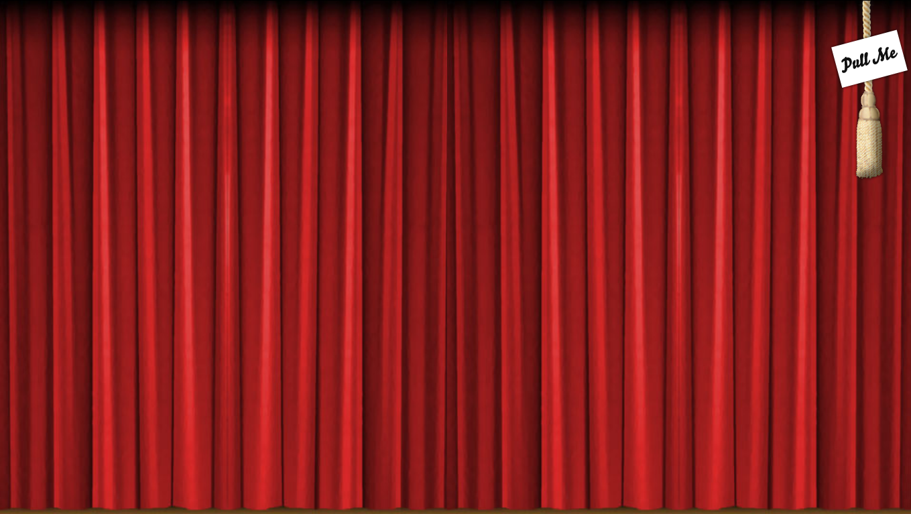

#Animate Curtain Opening with jQuery

------------

Screenshots:

------------

#### Created By [Sam Dunn](https://twitter.com/sdunn) ** 2009 

#### Collect From [Build Internet](http://www.buildinternet.com) ** 2015

#### Modfied By [Khan Sunny](http://itkhansunny.github.io) ** 2018